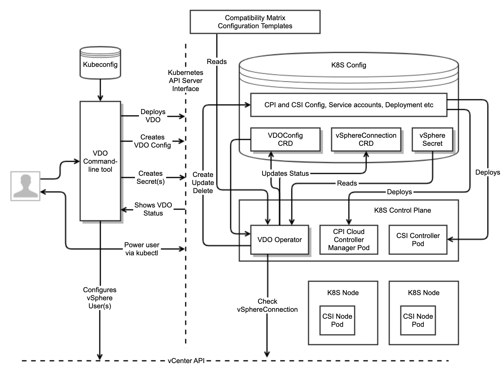
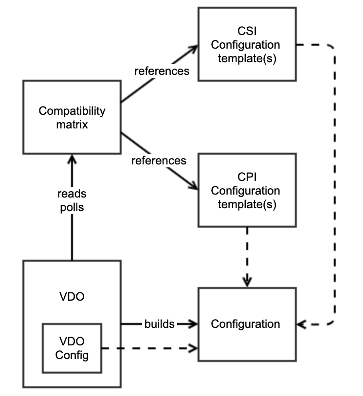

# Architecture

## Background

Kubernetes Operators are an increasingly popular and common form of extending Kubernetes and have become a
defacto standard for OpenShift, as can be seen at [OperatorHub.io](https://operatorhub.io/).

In order for a Kubernetes cluster to function on vSphere, in many (but not all) circumstances it
must authenticate with the vCenter control plane. The most common reason for doing this is so that
Kubernetes can allocate [Volumes](https://kubernetes.io/docs/concepts/storage/volumes/),
either as block devices on a vSphere Datastore or if it wants to
use a [vSAN fileshare](https://vsphere-csi-driver.sigs.k8s.io/driver-deployment/installation.html#vsphere-configuration-file-for-file-volumes-).
Integrated solutions on vSphere such as [TKG](https://docs.vmware.com/en/VMware-Tanzu-Kubernetes-Grid/index.html)
do this authentication automatically, however for 3rd party solutions, it must be done manually.

Kubernetes has some important abstractions that have evolved over the years:

**CPI** - The [Cloud Provider](https://github.com/kubernetes/cloud-provider) abstraction.
This is intended to be the interface between Kubernetes and the underlying Cloud fabric,
designed primarily for things like allocating Layer 4 load-balanced services, checking
the existence of virtualized nodes and persistent storage. Over time, the storage part
moved out into CSI. vSphere has a [CPI driver](https://github.com/kubernetes/cloud-provider-vsphere). 

**CSI** - The [Container Storage](https://kubernetes-csi.github.io/docs/) abstraction. 
This is intended to provide an abstraction layer for different types of persistent storage. 
vSphere has a [CSI driver](https://github.com/kubernetes-sigs/vsphere-csi-driver).

**CNI** - The [Container Network](https://github.com/containernetworking/cni) abstraction.
CNI was defined independent of Kubernetes, but Kubernetes has standardized on it as a means
of defining how containers can be networked together. There is an
[NSX-T CNI driver](https://docs.vmware.com/en/VMware-NSX-T-Data-Center/2.4/com.vmware.nsxt.ncp_kubernetes.doc/GUID-22D54FC5-4B06-4FE1-86A9-96A953FA15B9.html)
called NCP that uses Open vSwitch and there is also an [Antrea CNI driver](https://github.com/antrea-io/antrea).
Any CNI can be used with Kubernetes on vSphere for inter-container communication,
but if layer 4 load-balancing is required, this has to be integrated with a load balancer control plane.

There is already an [Open Source Operator for the Antrea CNI driver](https://github.com/vmware/antrea-operator-for-kubernetes).

## Business Problem

Deploying a non-VMware Kubernetes distribution to vSphere and manually installing the drivers
is not a great user experience. There are many issues such as:

- Out of date documentation
- No common authentication format
- Opinionated, convoluted and fragile configuration file formats
- Manually match the driver versions with the vSphere and Kubernetes versions
- No simple way of configuring vSphere with a user that has access controls with least privilege
- The need to install GOVC and manually configure VMs with specific properties for CPI
- The need to understand how to match vSphere and Kubernetes Region/Zone configuration
- The need to pre-configure kubeadm with obscure options
- Confusing and misleading error messages

Some of these issues can be fixed relatively easily by updating the documentation, improving error messages
and decoupling CSI from CPI. However, our users and partners expect more than this and have requested that
we create a Kubernetes Operator that automatically handles the majority of tasks that currently must be done manually.

The primary objective of this architecture is to create such an Operator that satisfies the requirements for OpenShift

## Goals

**Primary goal**: To create a Kubernetes Operator (VDO) that automatically handles the installation and
upgrade of the necessary vSphere drivers, requiring a minimum of input for the user. VDO will have the following characteristics:

- Designed to work with RedHat and vanilla Kubernetes clusters. This means it must be coded against the
[OpenShift Operator SDK](https://github.com/operator-framework/operator-sdk)
- Will reach the "Seamless Upgrades" capability level defined in the
[Openshift Operator maturity model](https://docs.openshift.com/container-platform/4.1/applications/operators/olm-what-operators-are.html#olm-maturity-model_olm-what-operators-are)
- Configuration of VDO is designed for the 90% of users who want to get up and running quickly.
Power users will be able to configure a larger subset of advanced options
- Health and monitoring should be front and center of every aspect of the user experience.
If something is not working, it should be clear and obvious how to remedy it
- Automatically chooses appropriate driver versions to install or upgrade based on an online
compatibility matrix, which is independent of operator releases
- Is capable of working in air-gapped environments or environments with no access to public internet
- Is able to configure a vSphere user with access controls that grant minimum privilege for a given configuration
- Works with any CNI implementation
- Supports vSphere CSI install only (presumably with a 3rd party CPI driver) if no CPI config is created
- Works with any version of vSphere supported by currently maintained CPI and CSI drivers
- Works with any version of Kubernetes supported by currently maintained CPI and CSI drivers
- This project will be developed [fully in the open](https://github.com/vmware-tanzu/vsphere-kubernetes-drivers-operator)

## Non-Goals

- No paravirtual integration with [Supervisor](https://docs.vmware.com/en/VMware-vSphere/7.0/vmware-vsphere-with-tanzu/GUID-21ABC792-0A23-40EF-8D37-0367B483585E.html)
in [vSphere with Tanzu](https://docs.vmware.com/en/VMware-vSphere/7.0/vmware-vsphere-with-tanzu/GUID-70CAF0BB-1722-4526-9CE7-D5C92C15D7D0.html)
at this time, although it will work in a Kubernetes deployed to a vSphere cluster enabled for Workload Management.
  - It should be assumed that paravirtual integration will be a future goal of this project.
- No integration of [VM Operator](https://github.com/vmware-tanzu/vm-operator) or [CAPV](https://github.com/kubernetes-sigs/cluster-api-provider-vsphere) at this time
- No explicit integration with NCP, rather it remains CNI-agnostic
- No integration with the Antrea Operator (see discussion below)
- No explicit support for other 3rd party Kubernetes distributions other than OpenShift,
although support for vanilla Kubernetes should mean that it will just work
- No integration with load-balancers, although this would be a good future goal
- No support for ensuring that Kubernetes CPI and vSphere Region / Zone configuration matches up, although this would be a good future goal
- No support for UI integration with vSphere, although this would be a good future goal

## Proposed Architecture

Here is a high-level diagram of the architecture showing the net new components with a shadow



### VDO Command-line tool

The VDO command-line tool is designed with a few goals in mind:

1. Simplify the deployment of VDO, so that the typical user does not need to have any knowledge about CRD schema,
service accounts, roles, deployments or any boilerplate YAML
    1. Note that power users can choose to apply CRDs and YAML directly via kubectl if they desire
2. Create and manage user accounts in vSphere that VDO will use for the CSI and CPI drivers
    1. User accounts should be created with least privilege
    2. vSphere Admin credentials for the user management would be used for just that specific operation and would not be persisted anywhere
    3. The necessary Secrets for the user account(s) created would then be automatically created in the target Kubernetes cluster
3. Summarize the VDOConfig and vSphereConnection CRD statuses so that the user can get a quick and easy summary. Eg:
    1. Shows the versions of drivers currently installed
    2. Shows the health of the drivers
    3. Shows the vSphere user(s) currently in use and the connection status
4. Provide the option to upgrade the drivers, if an upgraded version is available. There are two mechanisms by which this can be achieved
    1. By downloading an updated version of the command-line tool, which should contain the latest compatibility
matrix and configuration templates. The tool can then apply an update to the VDO config. VDO then takes responsibility
for updating the drivers. This is the *Static* method (see below)
    2. By updating an online version of the compatibility matrix that VDO is watching. VDO should then automatically
update the drivers. This is the *Dynamic* method (see below)
5. Provide the option to upgrade the VDO driver
    1. Since the VDO command-line tool and VDO deployment are intentionally tightly-coupled, you update one by updating the other.

We would expect the VDO command-line tool to be tightly-coupled to the VDO operator and as such will be a part of the same project,
using the same version numbers. As such, the command-line tool will upgrade/downgrade the VDO operator by virtue of the
Deployment/Pod/Container config that it generates. Thus if a user wants to upgrade their VDO, they only need to update the command-line tool.

The VDO command-line tool authenticates with a Kubernetes cluster using a kubeconfig file, just like kubectl.

The VDO command-line tool should block when it is deploying VDO and it should report simple status summary back to the
command-line. It should not return until the drivers have installed successfully. While this is not the expected UX for
power-uses with kubectl who expect asynchronous operation, it is a more natural UX for average users who would expect scripts
to block until they've completed. 

The command-line tool should respond to signals in the way the user would expect and if
the user does choose to kill the command-line tool during install (for example if the install is not succeeding), the
operation will continue asynchronously in the background and they can use the command-line tool to report on the status.

### VDO Operator

The VDO operator is the container that runs the control loops that manage the lifecycle of the CSI and CPI drivers.
It is configured by the VDOConfig CRD. The core functions of the operator are as follows:

1. Obtain and apply all of the configuration necessary for CPI and CSI drivers to function correctly
    1. In a typical environment, VDO is configured with access to a Compatibility Matrix and does the following:
        1. Reads the compatibility matrix and determines which version of CPI and CSI it is going to configure (based on K8S and vSphere versions)
        2. Obtains the correct configuration YAML for the CSI and CPI drivers selected (typically bundled with the matrix)
        3. Performs a substitution for specific parameters in the configuration YAML pertinent to the installation
        4. Deploys the YAML
    2. It should be possible to explicitly specify the CPI and CSI version
        1. Explicitly specifying the CSI/CPI version will disable any auto-upgrade function
        2. This will still require CSI/CPI YAML for the correct version to be provided as a template
2. Check that the CPI and CSI drivers are running correctly and are healthy
    1. If they are not, VDO should attempt to redeploy the configuration
    2. It should be clear from the VDOConfig Status if there is a problem
3. Look for vSphereConnection CRDs and periodically attempt to authenticate and validate the configuration
    1. The results of the validation are displayed in the vSphereConnection CRD Status
    2. Note that CSI and CPI maintain their own connections to vCenter. The configuration for this is derived from the vSphereConnection CRD Spec.
4. Update VDOConfig Status to summarize status of the drivers and vSphereConnections
5. Periodically check the compatibility matrix (assuming it has access to one) against the version of vCenter and Kubernetes. Upgrade if necessary.

#### Deployment

The VDO operator will be deployed as a single pod in a Deployment with a ReplicaSet that will ensure that one instance
will always be running. There should be no need for more than once instance of this pod given that it is not in the critical
path for any application function. in the worst case if the pod is unavailable, it won't be able to repair or upgrade one of the drivers.

Even though the operator is not in the critical path, it should be deployed by default in a manner that ensures
it will not be evicted in the case the cluster comes under pressure.

We should follow existing convention in terms of the namespace where the VDO assets are deployed.
If there is something like a vmware-system namespace that our tools and drivers use, that would be the obvious target.

VDO will need to be deployed with a ServiceAccount and RoleBindings that give it the necessary authorization to deploy,
update and delete driver objects. For many versions of the drivers, this means that it will need to be authorized to
the kube-system namespace. We should ensure that we configure this ServiceAccount with least privilege.

### VDOConfig CRD

The VDOConfig CRD encapsulates all of the configuration necessary for the VDO to function, but does not contain any authentication state.

The VDOConfig Spec should be very simple for the majority of configurations, but should allow for more complexity for power users.
This means that it should be designed in such a way that the majority of it is optional.

The VDOConfig should not contain any parameters that configure specific attributes of the container itself, or anything low-level
that exposes implementation detail. Those configuration options can be passed in to the container on the command-line.
Examples of such options would be particular modes that VDO should operate in, the location of the compatibility matrix, logging levels etc.

At a high level, it should comprise:

- Parameters for CPI configuration. This will be optional as there will be valid use-cases where the vSphere CPI is not required.
  - Optionally it should be possible to select a subset of vSphereConnection definitions, otherwise it should be assumed that all are used.
- Parameters for CSI configuration. This should be the common user-configurable options, such as the vCenter options for block/file storage.
  - Optionally it should be possible to select a subset of vSphereConnection objects, otherwise it should be assumed that all are used.

### vSphereConnection CRD and Authentication Secrets

There are currently a variety of different ways in which vSphere Kubernetes plugins and drivers authenticate.
CPI and CSI currently use opaque and unique configuration file formats that conflate authentication with configuration.
CAPV is another project that has its own mechanism for authentication.

This architecture proposes that we have a common mechanism for authentication that clearly separates the credentials
from the configuration and which is able to clearly disambiguate authn/authz problems from other configuration problems.
Additionally it should be possible to have the same credentials with different configurations.

For this reason, I propose that VDO standardizes on the common Kubernetes Secret format and is able to wrap credentials in
configuration specific to the vSphere connection, hence the proposal for a vSphereConnection CRD. The Status field of a
vSphere connection will contain information pertinent to whether vSphere is available, whether the provided authentication
works and whether the user is authorized to access any resources that have been specified in the vSphereConnection.

As the diagram shows above, one of the control loops in VDO will be responsible for periodically performing validation on
the config defined in a vSphereConnection and populating the Status field. These Status fields will be rolled up into a
summary in the VDOConfig Status.

It should be noted that a valid configuration is that CPI and CSI use different vSphere user credentials and therefore
would use different vSphereConnection and Secret instances.

### Compatibility Matrix, Configuration and Container Images



One of the most important functions of VDO is its ability to automate the selection of driver versions that are appropriate
to the version of Kubernetes and vSphere in use. Version information needs to be selected both for initial install and
dynamically during the lifecycle of the cluster when upgrades will be performed automatically if necessary.

As such, there is a need for VDO to be able to access specific assets in order for it to generate its configuration. These include:
- The Compatibility Matrix, which is a human-readable document in a structured format such as JSON
- Configuration template(s) specific to the version(s) of CSI and CPI being used.
- The container image binaries for the CSI and CPI drivers

Note that the design of the format of these assets is beyond the scope of this architecture and should be provided
in a separate design document. 

The design must balance the need to be able to get demo environments up quickly and easily,
while also ensuring that we have secure online and offline transport mechanisms for these assets.
Currently, users have to manually copy the configuration from the public GitHub,
find a place to persist it and then work out how to customize it.
Additionally, they have to have a container image registry that is reachable by the K8S cluster which needs to be
configured with the correct credentials. There is then no option to auto-update.

#### VDO Auto-update Mechanism

With VDO, we envisage 2 approaches to delivering these assets:

**Dynamic**: A network URL is provided to the compatibility matrix, which itself has network URLs to the configuration
templates for each version. VDO pulls the data from the URL, which could be public or private. VDO will poll for updates
and depending on the version update policy, will auto-update the drivers. The auto-update behavior requires that the URL
of the container images is already correct in the configuration templates.

**Static**: The VDO command-line tool pushes the compatibility and configuration state as a bundle to the cluster where
it is persisted Eg. using an EmptyDir or ConfigMap Volume. VDO will then pull from file-based URLs that correspond to the
VDO volume mount chosen. The contents of the volume can be updated by a new version of the VDO command-line tool.
The VDO command-line tool should make it easy to override the URL of the container images.

The advantage of Dynamic mode is that it allows for simple Quickstart Demos where access to public internet can be assumed.
Users wanting this dynamic behavior, but better security or control over the compatibility matrix and its configuration
state can choose to copy and host it in a private intranet where it can be updated in a more controlled fashion.

Users wanting the ultimate in security, stability and control can use Static mode. In order to facilitate this, the VDO
command-line tool will be built with all of the compatibility and configuration state necessary to support all of the
versions of CSI and CPI it is capable of deploying. In this mode, updates to new versions of CSI and CPI will necessarily
first require an update to the command-line tool.

The Compatibility Matrix must be capable of storing contextual data about a particular version of a driver. A specific
example of this is whether CSI needs a CPI in order to run. If only CSI is requested (without CPI) then only a subset of
the compatible version range can be used. This could also be necessary in the case where a particular driver version has
to be marked as bad (eg CVE) and shouldn't be deployed.

VDO itself should support as wide a range of Kubernetes and vSphere as possible. Users should simply be able to select
the latest VDO without having to consider compatibility issues.

#### VDO Auto-update Behavior

When it comes to auto-updates, there will be two kinds of user: Those who want new updates installed eagerly to ensure
that their cluster is always the most up-to-date and those who will want to prioritize stability and will only want
updates done if there is an issue of incompatibility. 
These policies can be expressed in a simple configuration option to VDO - something like

--update_policy=[latest,lts,disabled]
The most sensible default should be the one that causes the least surprises. 

The rolling back of an auto-update that has not successfully deployed is not MVP, but should be considered
in a future version. In such a case, if a rollback is triggered, the error must be reported as a Condition in VDO.

### Error Checking and Validation

A critical element to a good User Experience with Kubernetes is clear and actionable error reporting and validation checking.
VDO will use the following methods to ensure a good UX:

#### Logging

VDO should log clear details about what its control loops are doing. VDO should avoid being too verbose,
but provide a clear audit trail of key function such as:

- Operator initialization - have all the control loops initialized successfully? What configuration options is it defaulting to?
- Polling for the compatibility matrix - was it successful? Was there anything actionable?
- Creating the YAML for deployment - did it make the substitutions successfully?
- Kubernetes control plane operations - was it successful? What was the updated object ID?
- Validation checking of vSphereConnection - was it successful?
- Validation checks of driver install / upgrade - what checks were done and what was the result?

#### Validation Checks

VDO should have a clear set of preconditions that need to be met before it will install either CPI or CSI. 
Whether or not those preconditions have been met should be clearly visible to a power user with kubectl.

#### Conditions

VDO could use the concept of Conditions to describe the state of the drivers it's managing. See Node
[Conditions](https://kubernetes.io/docs/concepts/architecture/nodes/#condition) as examples.
The most obvious use case for conditions is displaying the Validation Checks that should be performed on the cluster and drivers.
Eg. Is CNI installed in the cluster? If CPI is installed, do the nodes have ProviderIDs?

#### Events

Any regular operation that VDO does can be published as an Event. This is very useful in both the success
and error cases in showing just how many times the operation succeeded or failed and some contextual information.

#### Phases

We should avoid the explicit use of Phases such as "running, upgrading, installing" etc. These can end up being
confusing to users and ultimately should be unnecessary if the Status, Events and Conditions are clearly presented.

#### Cmd-line tool

The command-line tool should be able to summarize the status of VDO and the drivers its managing in a fashion
that is simple to understand. As an example, if everything is running and installed successfully,
it should simply show the versions of the installed drivers and a single word status, such as "Healthy".
The purpose of this is simply to make it easy for the average user to validate the install.

## Abstract Example Deployment

### Quick demo

Assumes that the user has gone to the GitHub repo and downloaded the latest VDO for their client OS

```
> export VDO_KUBECONFIG=/tmp/kube.conf
 
> vdo help
Available Commands:
   version: Shows the version of VDO and the CPI/CSI driver versions supported
   status:  Shows the status of the VDO in the target cluster
   users:   Manage vCenter service accounts to be used for CSI and CPI
   secrets: Manage vCenter credentials for CSI and CPI
   deploy:  Deploys VDO to the target cluster
   help:    Show this help
 
> vdo version
VDO Version Data:
  VDO: v0.1.5
  CPI: v1.1.0 - v1.21.0
  CSI: v1.0.3 - v2.2.1
 
> vdo status
VDO Status:
  VDO: Not Deployed
  CPI: Not Deployed
  CSI: Not Deployed
 
Tip: To deploy VDO, use "vdo deploy"
 
> vdo deploy help
Available parameters:
   --cpi-container-image-url=<URL>      The image repository URL of the CPI container image (do not specify version)
   --csi-container-image-url=<URL>      The image repository URL of the CSI container image (do not specify version)
   --compatibility-matrix-url=<URL>     Network location of a dynamic compatibility matrix (optional)
 
Tip: For a quick deployment, you will be prompted for vCenter secrets
 
> vdo deploy \
  --cpi-container-image-url=https://registry.com/cpi-image \
  --csi-container-image-url=https://registry.com/csi-image \
Please enter the vCenter URL you want to connect to:
> 192.168.32.16
Please enter the vCenter user ID you wish CPI and CSI to use:
> administrator@vsphere.local
Please enter the vCenter password you wish CPI and CSI to use:
> sdfiuhwevg234
 
...Deploying vCenter secret
...Configuring VDO
...Deploying VDO
 
 
Tip: Please run "vdo status" to check deployment status
 
> vdo status
VDO Status:
  vCenter Version: v7.1.0
  VDO: Running
     Version: v0.1.5
  CPI: Running
     Version: v1.21.0
  CSI: Running
     Version: v2.2.1
```
