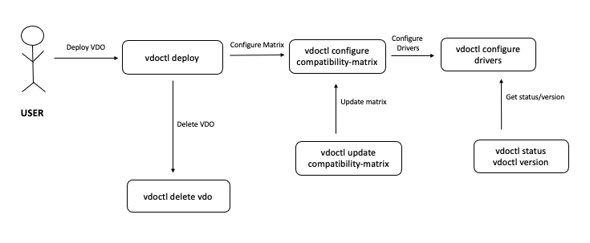

# Getting Started

VDO(vSphere Kubernetes Driver Operator) is built out of operator-sdk.
The operator is configured to run on master node, with a single replica deployment.

VDO operator is built to run on vanilla k8s cluster as well Openshift clusters

With every new release of VDO, support for new features and various bug fixes are delivered

## Assets

Each release is launched with the following deliverables

### VDO Docker Image

Docker image for VDO can be found [here (vdo.tar.gz)](https://github.com/vmware-tanzu/vsphere-kubernetes-drivers-operator/releases/) 

### VDO Deployment file

[Deployment file (vdo-spec-vanilla-k8s.yaml)](https://github.com/vmware-tanzu/vsphere-kubernetes-drivers-operator/releases/) containing the specs of VDO which includes the CRD, Service accounts, Roles and Role Binding details 

### Compatibility matrix

To fetch the compatible CSI and CPI version according to the respective kubernetes/ vSphere versions, a new [Compatibility matrix (compatibility.yaml)](https://github.com/vmware-tanzu/vsphere-kubernetes-drivers-operator/releases/) yaml is released with every release 

### Source Code 

If you wish to Contribute or setup the Developer's environment, you can download our source code in [Source code (zip)](https://github.com/vmware-tanzu/vsphere-kubernetes-drivers-operator/releases/) or [Source code (tar.gz)](https://github.com/vmware-tanzu/vsphere-kubernetes-drivers-operator/releases/) format and for further steps, refer to the [Developer guide](developer-guide.md)  

### VDOCTL

In order to deploy VDO using the command-line interface VDOCTL, you can follow the below steps 

#### Download the Binary

Download the VDOCTL binary and untar it as

- for Linux env
```shell
wget https://github.com/vmware-tanzu/vsphere-kubernetes-drivers-operator/releases/download/0.1.1/vdoctl-linux-0.1.1.tar.gz
tar -xvf vdoctl-linux-0.1.1.tar.gz
```

- for Mac env
```shell
wget https://github.com/vmware-tanzu/vsphere-kubernetes-drivers-operator/releases/download/0.1.1/vdoctl-mac-0.1.1.tar.gz
tar -xvf vdoctl-mac-0.1.1.tar.gz
```

Move the vdoctl executable to location in the `$PATH` folder

#### Pre-requisite

Before deploying the operator, set the KUBECONFIG path by
```shell
# Set up environment variables by
export KUBECONFIG=~/.kube/config
or YOUR-KUBECONFIG_PATH
```

#### User flow



#### Deploy VDO Operator

Run the [vdoctl deploy](vdoctl/vdoctl_deploy.md) command to deploy VDO 

```shell
vdoctl deploy --spec https://github.com/vmware-tanzu/vsphere-kubernetes-drivers-operator/releases/download/0.1.1/vdo-spec-vanilla-k8s.yaml
```
Here, `spec` flag inputs the file containing details about the CRD, docker image, default compatibility matrix

For more details, please refer [vdo-spec-vanilla-k8s.yaml](https://github.com/vmware-tanzu/vsphere-kubernetes-drivers-operator/releases/)


#### Configure Compatibility Matrix

Once the VDO is deployed, you will see that the VDO manager pod is in `Running` state and configures the default compatibility matrix
```shell
vmware-system-vdo    vdo-controller-manager-5bd4ffcc88-z5ltl      2/2     Running   0          40s
```

Configure custom compatibility matrix to fetch compatible CSI and CPI yamls using [vdoctl configure compatibility-matrix](vdoctl/vdoctl_configure_compatibility-matrix.md) command

```shell
vdoctl configure compatibility-matrix
✔ Web URL
Web URL https://github.com/vmware-tanzu/vsphere-kubernetes-drivers-operator/releases/download/0.1.1/compatibility.yaml
Tip: Compatibility matrix has been configured, you might want to try 'vdoctl configure drivers' to configure vsphere drivers.
```
The Compatibility matrix used can be found [here (compatibility.yaml)](https://github.com/vmware-tanzu/vsphere-kubernetes-drivers-operator/releases/)


#### Configure Drivers

To configure the CloudProvider and StorageProvider, run the [vdoctl configure drivers](vdoctl/vdoctl_configure_drivers.md) command

For more details, please refer [Configure Drivers](configure_drivers.md)


#### Status of Drivers

Once the drivers are deployed, status of CloudProvider and StorageProvider can be fetched using [vdoctl status](vdoctl/vdoctl_status.md)

```shell
vdoctl status 
CloudProvider   : Configured
	 vCenter : 
		10.10.10.10  (Credentials Verified)
	 Nodes : 
		 master-vm : ready 
		 worker-vm : ready 
StorageProvider : Deployed
	 vCenter : 
		10.10.10.10  (Credentials Verified)
```

#### Version of VDO and Drivers

Version of VDO and drivers can be fetched using [vdoctl version](vdoctl/vdoctl_version.md)

```shell
vdoctl version
kubernetes Version : 1.21
VDO Version        : v0.1.0-beta
vSphere Versions   : [7.0.3]
CSI Version        : 2.2.1
CPI Version        : 1.20.0
```

#### Update Drivers

Drivers can be updated by updating the compatibility matrix using [vdoctl update compatibility-matrix](vdoctl/vdoctl_update_compatibility-matrix.md) command

```shell
vdoctl update compatibility-matrix <path-to-updated-compat-matrix>
Compatibility matrix has been updated successfully.
```
Existing pods of CloudProvider and StorageProvider are terminated and new pods are spawned according to the compatible versions of CSI and CPI 


#### Delete VDO

To delete the VDO deployment and associated artifacts from the cluster provided, run the [vdoctl delete vdo](vdoctl/vdoctl_delete.md) command

```shell
vdoctl delete vdo
This command deletes the VDO operator deployment eventually the operator pods will be deleted
```
