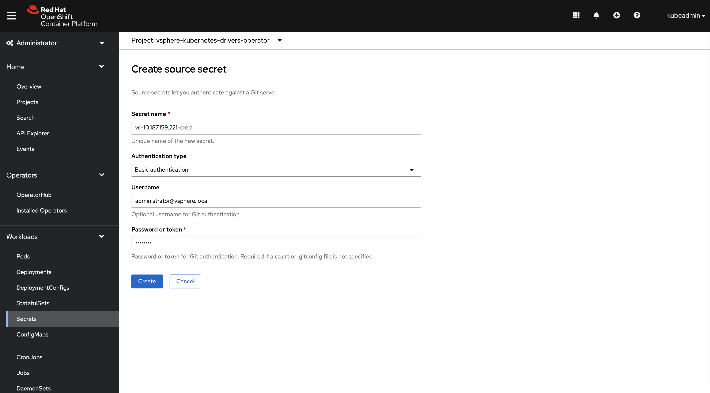
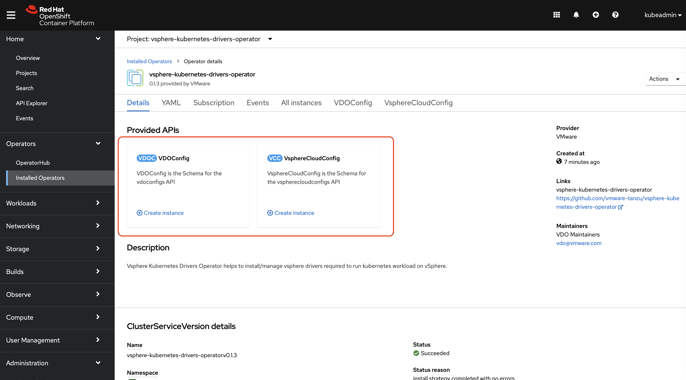
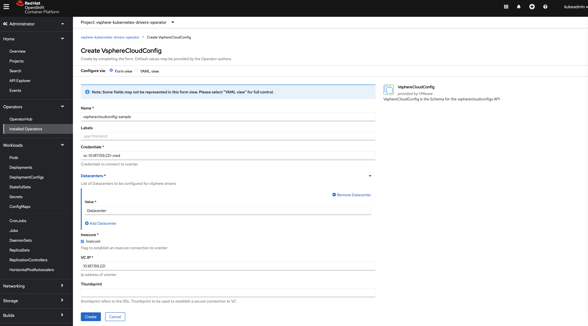
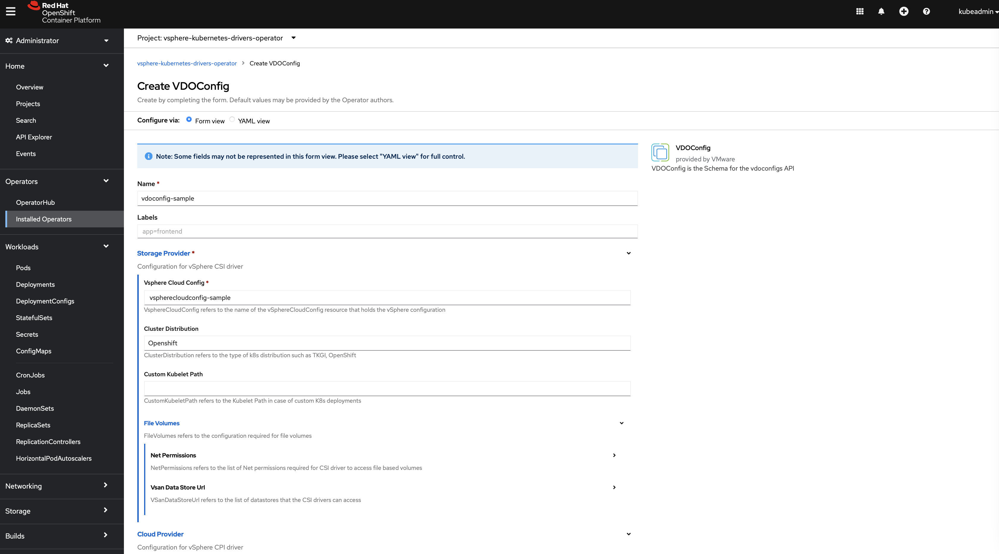
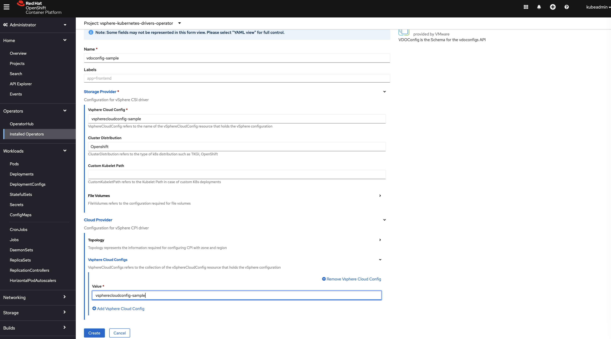

## Configuring VDO via Openshift Web Console

The easiest way to configure VDO is to configure the CRD's via Openshift Web Console, follow the steps below for the configuration.

#### Pre-requisite

You should have below data in handy.

- IP address of vcenter
- Secure Connection - If you choose to establish a secure connection to vcenter, you need to provide a ssl thumbprint
- Login credentials for vcenter
- Datacenter(s) - you can provide a comma separated list of datacenters

### Step-1
Make sure the VDO is up and running, for this you can go to `Installed Operator` side menu and confirm the status of the operator as Succeeded.

### Step-2
Create the secret with the credentials for your VC of a type `Source secret`
Main Page --> Right Side Menu --> Workloads --> Create Secret(Source secret type)  
**Make sure you create secret in the `kube-system` namespace**

### Step-3 
Click on the running operator from Step-1 and see the list of `Provided API's`.

### Step-4
If you want to configure CPI then click on `Create Instance` in `VsphereCloudConfig` from the last Step.

Important Points to be noted here : 
1. You have to use the same name of the secret which you created in Step-2 in the `Credentials` field.
2. Giving Datacenter is must in this step.

### Step-5
Configure CSI by clicking on `Create Instance` in `VDOConfig` from the Step-3.

**5.a** Configure CSI

You can configure CSI by adding the `Vsphere Cloud Config` name which we created in Step-4.  
You can add cluster distribution as `Openshift`.  
Configure `Custom Kubelet Path` and `File Volumes` as required.

**5.b** Configure CPI [Optional]

You can configure zones and regions if required.
You have to add the `Vsphere Cloud Config` name which we created in Step-4. 

Click on `Create` Button to finish configuring VDO.

Once done, you can check the status of these drivers by checking the `Pods` in Workload Section.

