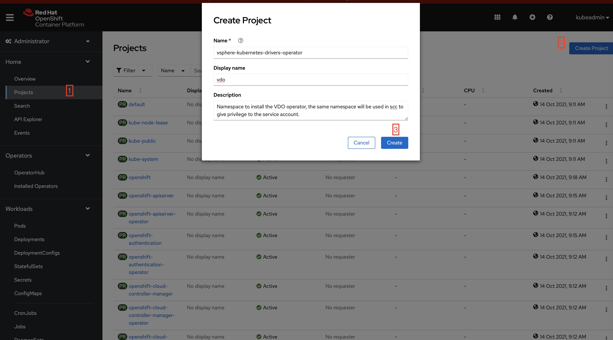
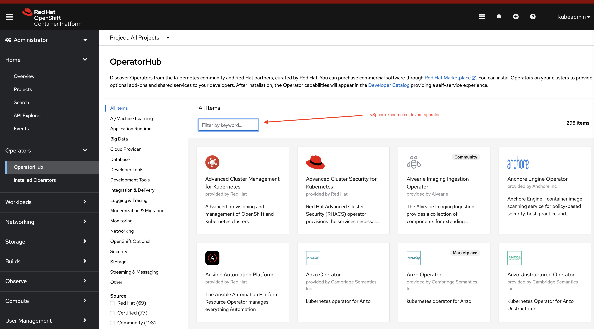
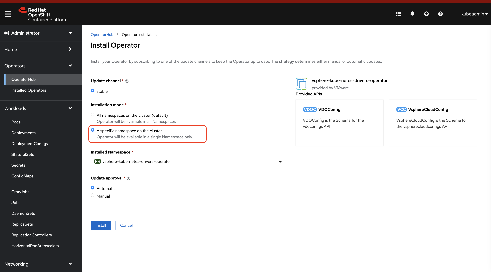

## Installation of VDO from Operator Hub

You can straight away install the vSphere-Kubernetes-drivers-operator(vdo) from OperatorHub, however to make it work 
seamlessly you need to add some SecurityContextConstraints as a cluster admin.

For installation, you can follow the below pre-requisites:

#### Pre-requisites
- [Recommendation] Create a project/namespace where you want to install vdo.

- [Recommendation] Create a `SecurityContextConstraints` which allows the `vdo-controller-manager` serviceaccount 
to have a permission of HostPath and HostNetwork Volumes in a specified namespace.
Login --> Ride Side Menu (Administration) --> CustomResourceDefinitions --> Search (SecurityContextConstraints) --> Instance(From Tab) --> Create SecurityContextConstraints (Click)
The new scc should look something like this 
```shell
apiVersion: security.openshift.io/v1
kind: SecurityContextConstraints
metadata:
  name: example
allowPrivilegedContainer: true
allowHostDirVolumePlugin: true
allowHostNetwork: true
allowHostPorts: true
runAsUser:
  type: RunAsAny
seLinuxContext:
  type: RunAsAny
fsGroup:
  type: RunAsAny
users:
- system:serviceaccount:vsphere-kubernetes-drivers-operator:vdo-controller-manager
```
**Note:** It's purely upto cluster admin on how to configure these settings, prime goal is to have an scc which can give access to create hostNetwork and hostPath to serviceaccount `vdo-controller-manager` for a project. 


#### Step 1
Login to Openshift Web Console and navigate to Operator Hub from Left Side Menu, click on search field and type `vsphere-kubernetes-drivers-operator`


#### Step 2
Click on install and select the namespace which has required permissions as described in pre-requisite.


That's it, now you will be able to use the vdo via command line tool and configure the [drivers.](../configure_drivers.md) 
